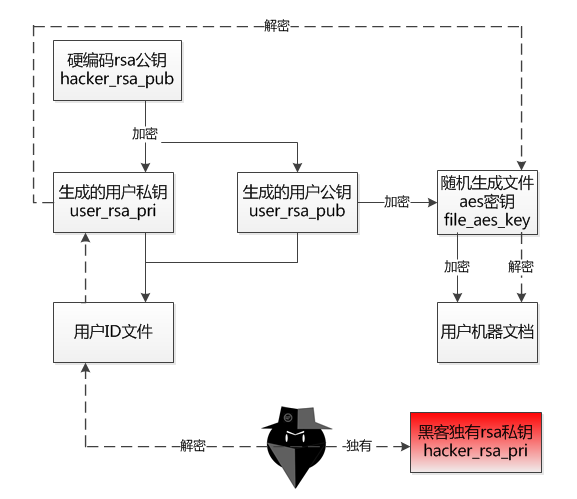

[TOC]

**勒索病毒**，又称**勒索软件**，是一种特殊的恶意软件，又被称为“阻断访问式攻击”（denial-of-access attack），与其他病毒最大的不同在于手法以及中毒方式。

# 一、传播途径

1、邮件

利用社会工程学方法欺骗受害者点击链接下载。

2、系统漏洞

例如WinXP和Win7等老旧系统存在的漏洞，使得病毒方便的在局域网甚至互联网上传播。

3、网页挂马

通过木马病毒的形式传播，将自身掩盖为看似无害的文件。

4、移动存储设备

比如U盘。

# 二、勒索病毒分类

主要分为两类：

## 1、非加密型勒索病毒

仅是单纯地将受害者的计算机锁起来。主要方式有：

1)、展示色情图片遮挡屏幕，干扰用户正常使用，比如WinLock病毒；

2)、显示网页，利用点击劫持手段干扰用户关闭页面；

3)、假借执法机关的名义，恐吓受害者被发现了色情、盗版文件等。

## 2、加密型勒索病毒

系统性地加密受害者硬盘上的文件。

| 病毒名称      | 时间    | 简介                                                         |
| :------------ | ------- | ------------------------------------------------------------ |
| CryptoLocker  | 2013.9  | 该病毒使用2048位的RSA加密密钥，并将其回传至主控病毒行动的服务器。使用白名单以只对特定的扩展名加密。 |
| TorrentLocker | 2014.9  | 含有与CryptoDefense类似的缺陷。该病毒对每台受感染的计算机都使用相同的密钥，导致安全单位能利用此弱点解开加密的文件。 |
| CryptoWall    | 2014.9  | 针对数个主要网站进行了攻击，将受害者导向至独立网站，利用浏览器漏洞传输病毒。 |
| KeRanger      | 2016.3  | 第一个在OS X操作系统上运作的勒索软件。该病毒将.DMG可执行档伪装成RTF文件。该病毒会潜伏三日，接着开始加密文件。该病毒也使用2048位的RSA公钥加密文件。 |
| Petya         | 2016.3  | 该恶意软件旨在感染主引导记录，安装有效负载，受感染的系统下次引导时便加密NTFS文件系统文件表，完全阻止系统引导进Windows，直至支付赎金。 |
| Manamecrypt   | 2016.4  | 该病毒宣称加密受害者的文件，事实上，该病毒却不将文件加密，而是将文件移动进入密码保护的RAR压缩档。 不过压缩档的密码很容易找到，使得受害者有方法能取回受感染的文件。 |
| Mischa        | 2016.12 | 该病毒会将加密的文件改为特定的扩展名，如.3P7m、*.arpT*、.*eQTz*、*.3RNu*等。遭受感染的受害者计算机会在浏览器内显示出威胁消息，声称计算机已经遭到“军规级加密”。 |
| WannaCry      | 2017.5  | 利用Windows系统漏洞进行侵入的一款勒索病毒，全球超过230,000台计算机皆遭此病毒侵害，此病毒要求支付价值等同于300美元的比特币才可解密所有遭加密文件。受害者计算机大多数皆装载Windows 7系统，微软也针对此漏洞进行更新。 |
| NotPetya      | 2017.6  | 主要针对乌克兰的全球性网络攻击。经修改的版本和WannaCry同样使用永恒之蓝漏洞传播。由于设计变更，即使支付赎金系统也不会真正解锁，故安全分析师猜测这次袭击不是为了获取非法利益，仅仅是搞破坏。 |
| Bad Rabbit    | 2017.10 | 类似于WannaCry和Petya的模式，Bad Rabbit加密了用户的文件表后，要求支付比特币解锁。ESET认为，该勒索软件伪装成Adobe Flash更新发布。 |
| Mind Lost     | 2018.2  | 通过要求受害者使用信用卡或借记卡支付赎金，以此来套取银行卡信息，进而将此信息出售给不法分子牟取更大利益。 |
| 麒麟2.1       | 2018.3  | 通过QQ等聊天工具传文件方式传播，一旦中招就会锁定电脑文件，表面上要求扫码用支付宝付款3元，但实际上扫码是登录支付宝，登录后会转走支付宝所有余额。 |
| UNNAMED1989   | 2018.12 | 一个以微信为支付手段的勒索病毒，受害者必需通过微信扫一扫支付110元赎金才能解密。病毒通过DLL劫持方式，劫持正常程序执行其病毒功能，同时安装的恶意程序还会盗取用户的个人信息，据调查约5万余条数据遭到盗取。 |
| GandCrab5.2   | 2019.3  | 通过发送恐吓邮件，诱使用户下载附件，导致重要文件被加密且无法解密。 |

# 三、加密方式与解密

## 1、加密方式

> 勒索病毒使用了RSA+AES加密方式，加密过程中涉及两对RSA密钥(分别为黑客公私钥和用户公私钥，分别用hacker_rsa_xxx和user_rsa_xxx表示这两对密钥)和一对AES密钥。黑客RSA密钥用于加密用户RSA密钥，用户RSA密钥用于加密AES密钥，AES密钥用于加密文件内容。具体的加密过程为：勒索病毒首先解码出一个内置的RSA公钥(hacker_rsa_pub)，同时对每个受害用户，使用RSA生成公私钥（user_rsa_pub和user_rsa_pri），其中生成的密钥信息使用内置的RSA公钥(hacker_rsa_Public)进行加密后，做为用户ID。在遍历系统文件，对符合加密要求的文件进行加密。对每个文件，通过CoCreateGuid生成一个唯一标识符，并由该唯一标识符最终生成AES密钥(记为file_aes_key)，对文件进行加密。在加密文件的过程中，该唯一标识符会通过RSA公钥 (user_rsa_pub) 加密后保存到文件中。黑客在收到赎金、用户ID和文件后，通过自己的私钥(hacker_rsa_pri)解密用户ID,可以得到user_rsa_pri，使用user_rsa_pri解密文件，就可以得到文件的file_aes_key，进而可以通过AES算法解密出原始文件。

<u>（图片来源于腾讯安全）</u>

## 2、解密方式

1)、破解勒索程序

前提是勒索病毒程序存在漏洞，此方式成功概率较低。

2)、勒索者公开密钥

向勒索者缴纳赎金，或是祈祷勒索者大发慈悲。

3)、执法机关破获案件

执法机关获得勒索者服务器控制权，且密钥存储在服务器上，由执法机关公布。

4)、其他方式

另外，还可以尝试[国际刑警组织反勒索病毒网站](https://www.nomoreransom.org/zh/index.html)提供的解密工具。

<!--more-->